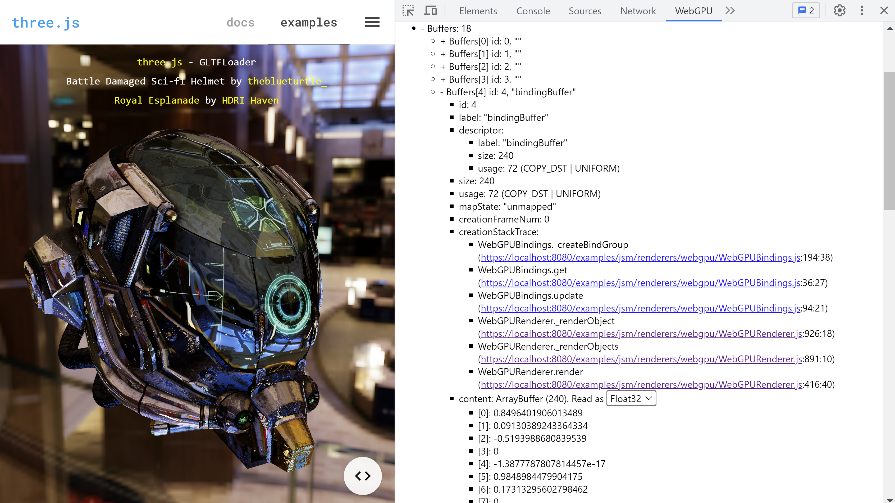
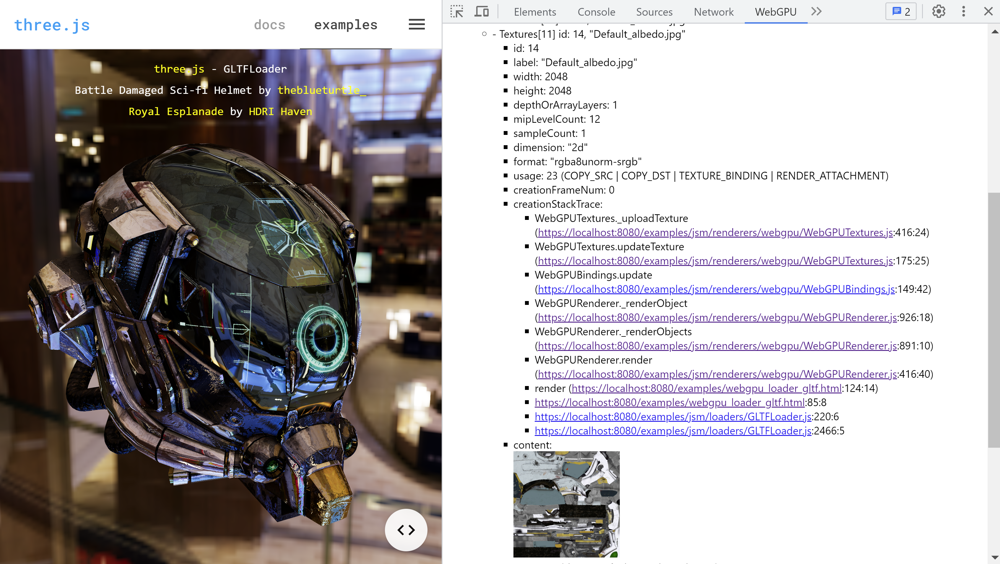
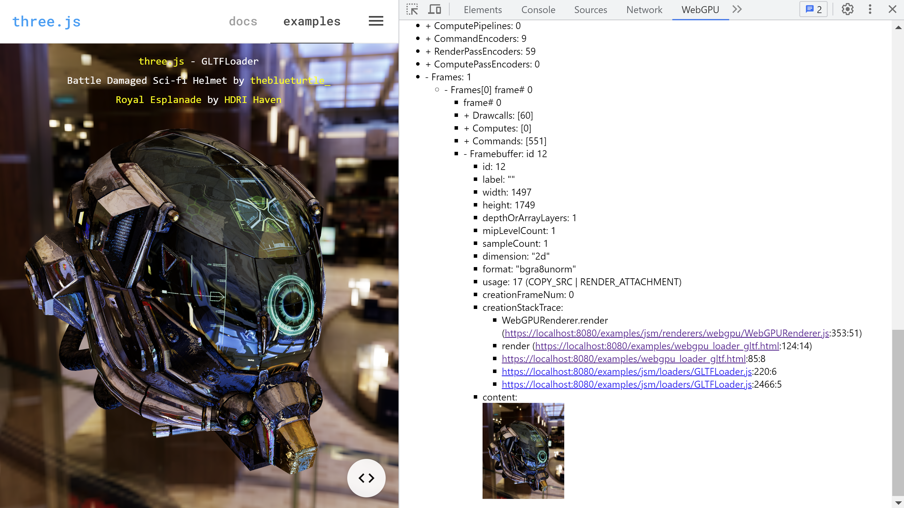
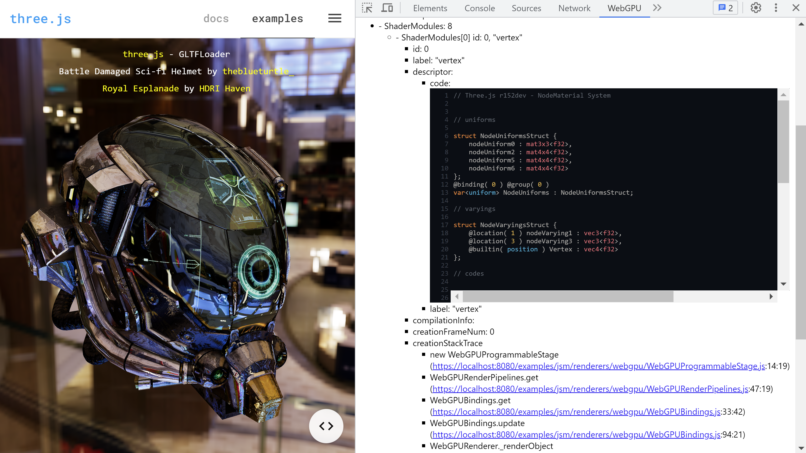
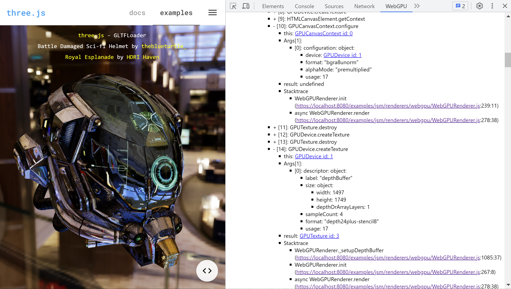
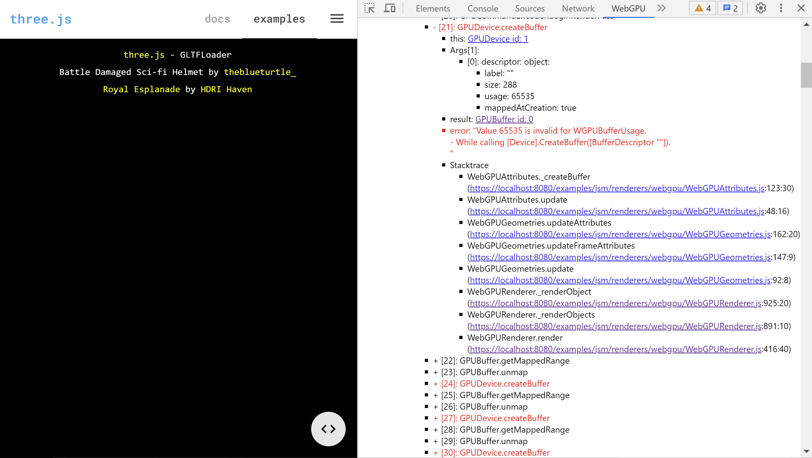

# webgpu-devtools

WebGPU devtools is a [Web browser extension](https://developer.mozilla.org/en-US/docs/Mozilla/Add-ons/WebExtensions)
that helps debug WebGPU applications by monitoring WebGPU usage.

**Note:** This project is still at alpha stage.
The WebGPU devtools may be unstable and buggy now.
See the GitHub issues and inline random TODO comments for things that need work.

## WebGPU

WebGPU is a new Web graphics API, which will be available by default
in Chrome 113. Please refer to [this page](https://developer.chrome.com/blog/webgpu-release/)
for details.

To try WebGPU use Chrome 113 (it is [Chrome Beta](https://www.google.com/chrome/beta/) at
writing this README on Apr.22.2023) or newer. Or enable WebGPU via `chrome://flags` on older Chromes.

## Demo video

[Demo Video](https://twitter.com/superhoge/status/1650000134594523136)

## Screenshots









## Features

The Features of the WebGPU devtools are

* Track and show WebGPU objects
* Capture and show WebGPU commands
* Highlight WebGPU command errors
* Show [WGSL](https://www.w3.org/TR/WGSL/) shader code
* Show buffer, texture, and framebuffer contents
* Show WebGPU command call stacktrace

**Upcoming features**

* WebGPU commands record and replay [#5](https://github.com/takahirox/webgpu-devtools/issues/5)
* Memory leak checker [#6](https://github.com/takahirox/webgpu-devtools/issues/6)

Feel free to request features at [the GitHub issues](https://github.com/takahirox/webgpu-devtools/issues).

## How to install

1. Download the source code from this repository

```sh
$ git clone https://github.com/takahirox/webgpu-devtools.git
```

2. Manually load `webgpu-devtools/extensions` as an unpacked extension in developer mode.
Please refer to [this document](https://developer.chrome.com/docs/extensions/mv3/getstarted/development-basics/#load-unpacked).

## How to use

1. Go to a WebGPU application web page (eg: [Three.js WebGPU examples](https://threejs.org/examples/?q=webgpu#webgpu_loader_gltf))
2. Open WebGPU tab in [the Developer tools](https://developer.chrome.com/docs/devtools/open/#last)
3. Reload the web page
4. The WebGPU devtools captures the WebGPU usage of the first 50 animation frames or 5 seconds (TODO: Make it configurable [#4](https://github.com/takahirox/webgpu-devtools/issues/4).)
5. WebGPU usages are shown in the WebGPU devtools tab

If you want to capture another WebGPU application or capture the same application again,
just move there or reload the page. The WebGPU devtools panel will be reset and updated.
(See the "Known issues" section below if it doesn't work.)

The WebGPU devtools overrides WebGPU functions and tracks WebGPU objects.
They may affect performance, memory usage, and functionality in WebGPU applications.
You are recommened to enable the WebGPU devtools only when debugging.

## How to build locally

If you want to locally build the WebGPU devtools, clone this repository and then
run `npm install` and `npm run build` commands.

```sh
$ git clone https://github.com/takahirox/webgpu-devtools.git
$ cd webgpu-devtools
$ npm install
$ npm run build
```

## Known issues

* WebGPU devtools panel is not updated sometimes even after finishing the capcuring.
If you face this problem, try to reload the panel and application.
Refer to [#9](https://github.com/takahirox/webgpu-devtools/issues/9) for details.

Also see [the GitHub issues](https://github.com/takahirox/webgpu-devtools/issues) for others.

## Disclaimer

This software is provided for debugging purposes only. This software is not intended to be used
to steal WebGPU application contents.

This software is provided "as is" without warranty of any kind, either express or implied,
including but not limited to the implied warranties of merchantability and fitness for a
particular purpose. The author shall not be liable for any damages whatsoever arising out
of the use of this software, even if the author has been advised of the possibility of such damages.
